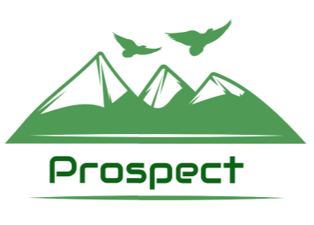

# Prospect

&nbsp;

## Purpose:

&nbsp;

Prospect: A mobile app where users compete to explore new places.
* To get people outside by visiting new places.
* Local businesses will also prosper from this.

## What it does:  

* Game where the more places you visit the more points you accumulate, rarer locations → more points → ranking page (profile)
* Shows nearby locations to visit
* When the locations are visited, they become colored
* Calendar/Trip planner so you can schedule your trips to these locations after finding them (we can provide pings as the date gets closer)
* Chat and share trips with Friends
* Build your profile with trips, photos, and interests  

## Features:
* Accessibility for people with color blindness
* Zoom and panning the map for people who have bad eyesight
* Shows nearby attractions and locations to visit
* Could be recommended based on certain parameters (distance, popularity, COVID-19 rates)
* Maybe Teams?  

## Pages:  

* Welcome
* Home
* Events/Ranking ( between teams & members)
* Individual
* Profile (rankings button, friends…)
* Team (limit on #)
* Friends
* Trip Planner

## Tech Stack:

Hosting:
* Digital ocean
* AWS or Google Cloud

Backend:
* Java Spring Boot with GraphQL
* SQL

Frontend:
* TypeScript
* React Native
* Apollo or URQL
* Code gen
